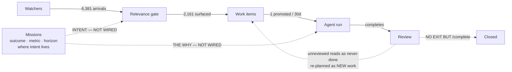

# Cue — design brief: intent, closure, and the shape of the work surface

**Date:** 31 August 2026
**Audience:** design
**Status:** problem statement + macro architecture questions. Deliberately not a solution.

All figures in this document were read from the production database
(`cue-manav-prod`) on 31 August 2026, read-only. Nothing here is estimated.

This consolidates three companion pieces. Read in order: the automation loop
(Part 1), the intake arithmetic (Part 2), the architecture (Part 3). Part 4 is
what we need design to answer.

---

## Part 1 — Why nothing runs

Four systems were built to automate the owner's work. Every one is alive, and
every one terminates before anything gets done.

**Of 1,839 work items, 18 have ever been completed.**

| | Count |
|---|---|
| Work items sitting in `queued` | 1,330 |
| Work items ever completed | 18 |
| Items marked `parked` (ineligible to auto-run) | 1,759 |
| Acts by any *named* agent | 0 |

### Where each system stops

**Watchers — terminates at triage.** Gmail, Calendar and Slack file work items
at industrial scale: 1,460 from Gmail alone, plus 201 calendar and 31 Slack.
Every one is created `parked`, so it can never auto-run. The only code that
cleared `parked` ran at dispatch — when an item was *already* running. There
was no promotion step, so 1,692 items could only leave the queue if the owner
pressed Run on each one individually.

**Missions — terminated at delivery.** Three missions cycle daily: 80 cycles,
68 plans, 68 reports — and **4 work items enqueued**. Total spend across all
three, 64 cents. The planner wrote a good assessment each cycle, recorded it
as a database row, emitted a live client event, and created nothing durable.
If the owner was not looking at that surface in that second, the report was
gone.

**Agents — never invoked.** Four agents exist with tiers, charters, domains
and caps. None is paused. All 73 recorded acts belonged to `cue`, the house
assistant; none to any named agent. Activity fell from 64 acts in July to 9 in
August.

**HQ — not part of this.** Worth saying plainly since it gets grouped in: HQ
is billing, provisioning and fleet. Its one agent-shaped field, `agentsOrg`,
is a *plan entitlement*. It has no role in automating work.

### The system already said why it was stuck

The mission planner is not broken. Two assessments, verbatim from production:

> "Progress is completely stalled because two critical items require your
> review: Ghita's AEF folders and the Rasmal partnership draft. Over 20 queued
> tasks cannot proceed until these blockers are resolved."

> "No project is linked to the mission, so no concrete fundraising tasks can be
> planned or executed. Immediate action is required from the founder to create
> a 'Seed Fundraising' project and link it to this mission before any outreach
> or planning can begin."

It knew it was blocked. It knew precisely what would unblock it. It wrote that
down 68 times, into a table nobody reads, and was charged for the thinking.

**Both named items had already been done.** They were sitting completed and
unreviewed for 21 and 31 days.

---

## Part 2 — Why the list grows

The task list is not badly sorted. It is an accumulator with no drain.

> **1,693 work items created in the last 30 days. One completed.**

That is not a sorting problem, a filter problem, or a UI problem. It is an
*arithmetic* problem, and no interface can be designed around it until the
arithmetic changes.

### In the owner's words

> "it's got so much junk I don't care about because it's pulling everything and
> not triaging well… the work I want to prioritize vs the work the system feeds
> me sometimes aren't matched… it's not always catching what's important… it
> should also be easy to inform it that I've completed stuff already and mark
> those as done and move on vs have stuff overload / linger."

Those read like several complaints. They are two: one about **intent**, one
about **closure**.

### Four causes, which compound

**1. Nothing removes items at the rate they arrive.** The only exits are run
it, review it, or archive it by hand — all three cost human attention, and
attention is the fixed quantity. Arrival is automated; departure is not. The
gap is roughly 1,700 to 1.

**2. Relevance is judged without reference to intent.** The gate that decides
what to surface asks a generic question — *is this a real message from a real
person?* It has no model of what the owner is trying to achieve this month, so
it cannot separate the Rasmal partnership (on a mission's critical path) from
an HSBC corporate-action notice. Both are genuine mail from real institutions.
The missions *do* encode intent. Nothing in the arrivals pipeline consults
them.

- 1,460 items from the Gmail watcher
- 136 bulk marketing items that should never have surfaced
- 611 raw "Email from …" rows with no task extracted

**3. "I already did that" has no cheap expression.** There is no gesture for
*done elsewhere*, *don't care*, or *not now*. An item can only leave by being
worked. So the list fills with things already dead in real life — and every
dead row makes the live rows harder to trust.

**4. The pile is the interface.** No state-of-the-world layer, no briefing, no
close-of-week. Re-entry means confronting ~1,400 rows and reconstructing the
situation from them. The cost of coming back scales with the backlog, which is
exactly when it is highest. The owner's word was "daunting".

### The loop

1. Items arrive faster than they can be cleared.
2. The list fills with stale, irrelevant, or already-handled things.
3. Signal-to-noise falls, so opening it is expensive and unrewarding.
4. It gets opened less often.
5. Fewer items are cleared — return to 1.

**This is why fixing the filter alone will not work.** A better filter improves
step 2 and leaves the arithmetic in step 1 untouched: the list still grows,
just with better-chosen items.

---

## Part 3 — Intent and closure (the architecture)

Cue has all six primitives it needs. **Two links between them were never
built**, and every symptom above comes out of those two gaps.

Solid edges exist and carry the measured production volumes. **Every dotted
edge is absent from the codebase.**

### What the two gaps cost

| Symptom | Measured | Gap |
|---|---|---|
| Created / 30d vs completed / 30d | 1,693 vs 1 | closure |
| Completed work waiting on review | 14, oldest 41 days | closure |
| Finished work re-planned as new | confirmed, 3 weeks apart | closure |
| Bulk marketing surfaced as tasks | 136 | intent |
| Raw email rows, no task extracted | 611 | intent |
| Items routed to a named agent | 1 of 1,908 | intent |
| Agents with charter, tier and cap | 4, all unpaused | already built |
| Missions with outcome + deadline | 3, cycling daily | already built |

### This was already diagnosed, and deferred for the wrong reason

The Paperclip execution brief (`docs/cue-paperclip-execution-brief.md`)
specified both gaps as one workstream, **WS2, at P0**. It was never built.

- **2A — goal ancestry.** *"The agent sees the task, not the why."* Thread
  mission outcome → project context → task into the agent's run context.
  **Verified absent:** no mission context in `buildWorkItemContextPreamble`.
- **2B — typed approvals.** *"`approvalStatus` is a never-written stub; Review
  approve/redo captures no type, reason or audit."* Add `reject` and
  `changes_requested` alongside `complete`. **Verified absent:** neither
  endpoint exists, and there is no approvals table. `/complete` is the only
  exit from review.

Both were deferred as delivering *"at team/commercial scale, not for one
user."* **That judgement is the thing to revisit.** Every measurement above is
from a single-user instance, and these are its two largest failures. Goal
ancestry is what makes ranking match intent for one person. A review that can
only say "done" is what stranded one person's finished work for 41 days.

WS1 (budget enforcement) and WS3 (liveness) from the same brief were built and
shipped. WS4–WS7 remain genuinely team-scale and can stay deferred.

### Paperclip's model vs ours

Their model is an **org chart with a heartbeat**: agents have a boss, a title
and a job description; work cascades company mission → project goal → agent
goal → ticket; agents wake on a schedule or a trigger; the human sits as "the
board of directors" with approvals, per-agent budgets that hard-stop, and full
audit logs.

| Paperclip primitive | Cue equivalent | Status |
|---|---|---|
| Company mission → cascading goals | Missions (outcome, metric, horizon) | have it |
| Agents with job descriptions | Agents (charter, domain, tier) | have it |
| Tickets with an owner | Work items (assignee) | have it |
| Per-agent budget that hard-stops | `capCents` + `hardStopEnabled` | shipped (WS1) |
| Audit log of every decision | Autonomy ledger, work-item events | have it |
| Goal lineage reaching the worker | — | **WS2A, unbuilt** |
| Typed approval with a reason | — | **WS2B, unbuilt** |
| A heartbeat that wakes each agent | Only missions cycle | **unbuilt** |
| Delegation along reporting lines | Flat roster, nothing routes | **unbuilt** |

Five of nine already exist. The gap is not capability.

---

## Part 4 — The macro questions for design

Architecture choices, not layout choices. Each changes what the product *is*,
and the answers determine every surface that follows. **We are asking design to
take a position on these before any screens.**

**1. Is the unit of attention the task, or the goal?**
Today it is the task, and the home screen is a flat list of ~1,400. Paperclip
makes the goal primary and the ticket a detail underneath it. If we follow, the
list stops being the home and becomes a drill-down — which reframes overload as
a view problem rather than a volume problem.
*Options: task-first (today) · goal-first · both, switchable*

**2. Who is allowed to close finished work?**
Only the human can today, with one gesture, and it has produced a 41-day queue.
The alternatives carry different risks: an agent that self-closes with
evidence; a time-based auto-close with a digest; a weekly batch review. **This
is the single highest-leverage decision in the brief.**
*Options: human-only · agent-closes-with-evidence · time-based + digest · batch*

**3. Is the roster an organisation, or a set of labels?**
Four agents exist with charters, tiers and caps, and one item in 1,908 has ever
reached one. Either they gain reporting lines, a heartbeat and delegation —
becoming a real org — or they collapse back into one assistant with skills. The
middle state we are in delivers neither.
*Options: real org (boss, cadence, delegation) · one assistant with skills*

**4. What is the daily surface?**
Re-entry currently costs as much as the backlog is deep, which is worst exactly
when returning after time away. A briefing, a room where work is visibly
happening, and a queue are three different products.
*Options: briefing · agent room · queue · conversation*

**5. Where does intent live, and who is allowed to read it?**
Missions hold it. The relevance gate, the triage scorer and the agent's run
context are all blind to it. Wiring it is small; deciding how much it should
*override* generic relevance is not — an over-tuned goal filter is how you miss
the thing that mattered but was off-plan, which is already one of the owner's
complaints.
*Options: advisory ranking signal · hard filter · per-mission opt-in*

---

## Part 5 — Then the weeds

Worth specifying only once the five above are settled, because each depends on
them:

- The dismissal gesture and its vocabulary — *did it*, *don't care*, *not now*,
  *never again* — and whether "never again" teaches the filter.
- What a closed item looks like when the *agent* closed it rather than the
  person.
- How a mission shows it is blocked without becoming another row in the pile.
- Whether agent cadence is visible or ambient.
- What the first screen shows after a week away.
- **The failure state that matters most:** what the system does when it is *not
  sure* whether something is important — given that both answers, burying it and
  surfacing it, are complaints we already have.

---

## Appendix — the numbers to design against

| Measure | Today | What good looks like |
|---|---|---|
| Items created / 30d | 1,693 | unchanged — capture is not the problem |
| Items completed / 30d | 1 | the number that has to move |
| Open queue | ~1,400 | bounded, stable week to week |
| Completed, awaiting review | 14 | near zero — it should close itself |
| Oldest unreviewed | 41 days | days, not weeks |
| Bulk marketing surfaced | 136 | zero |
| Items reaching a named agent | 1 of 1,908 | meaningful share, or retire the roster |

**Protect the first row.** Capture works, and it is the reason the important
things are in there at all. The goal is not to pull less — it is to make
clearing cheap enough that pulling everything stops being a cost.
